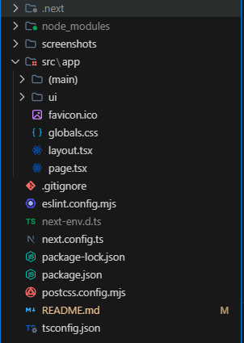
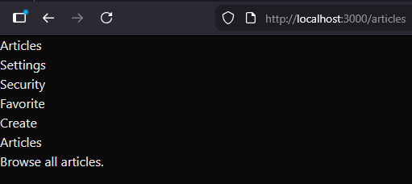
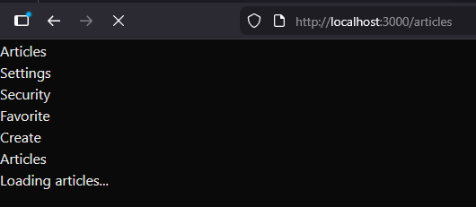
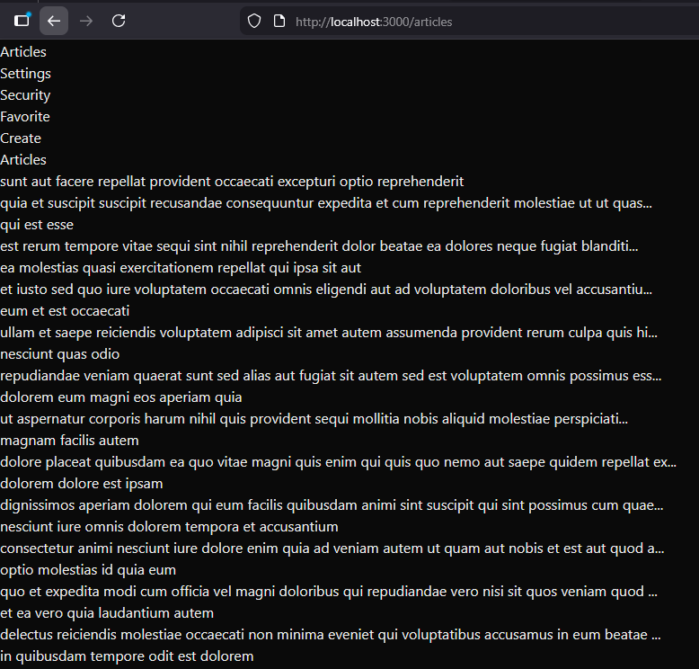
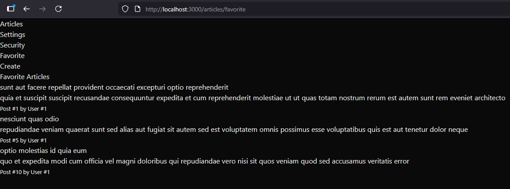
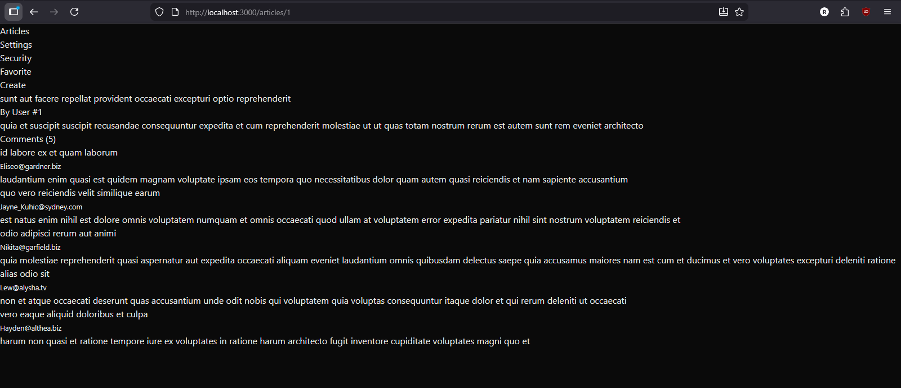
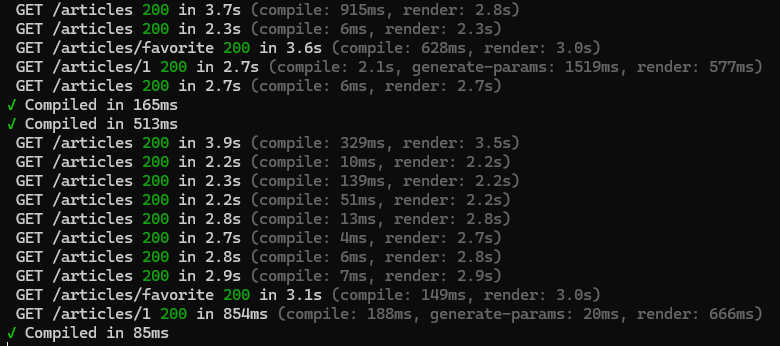

# NextJS Labs

A Next.js laboratory project built with TypeScript, Tailwind CSS v4, and App Router.

## Getting Started

### Prerequisites

- Node.js (v18+)
- npm

### Installation

```bash
npm install
```

### Development

```bash
npm run dev
```

Open [http://localhost:3000](http://localhost:3000) in your browser.

### Production Build

```bash
npm run build
npm run start
```

---

<details>
<summary><h2>Lab 1</h2></summary>

### Task 1 — Project Setup

- Initialized the project with `npx create-next-app` (TypeScript, ESLint, Tailwind CSS, App Router)
- Migrated to `src/` directory structure
- Cleaned default Next.js template

#### Screenshots

**Project structure after setup:**



---

### Task 2 — Pages & Navigation

- Created pages: `/`, `/articles`, `/articles/favorite`, `/articles/create`, `/profile/settings`, `/profile/security`
- Route Group `(main)` for shared layout (all pages except `/`)
- Main navigation: Articles, Settings, Security
- Articles sub-navigation: Favorite, Create
- Active link highlighting via `NavLink` component using `usePathname()`

#### Screenshots

**Home page (`/`) — no navigation:**


**Articles page (`/articles`) — main nav + sub-nav:**


**Profile Settings (`/profile/settings`) — main nav only:**



---

### Task 3 — Data Fetching

- Fetching all posts from JSONPlaceholder API on `/articles`
- `loading.tsx` shows loading state while articles are being fetched
- `/articles/favorite` — 3 independent `<Suspense>` boundaries with `FavoriteArticle` async component
- `/articles/[id]` — dynamic page fetching post + comments in parallel
- `generateStaticParams()` for static generation of articles with ID 1-10
- TypeScript interfaces for API responses in `lib/types.ts`

#### Screenshots

**Articles page loading state:**



**Articles list after loading:**



**Favorite articles list after loading:**



**Article detail page with comments:**



**Console output for fetching data:**



---

### Task 4 — Styling

> Coming soon.

---

### Task 5 — Design

> Coming soon.

</details>
