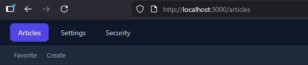
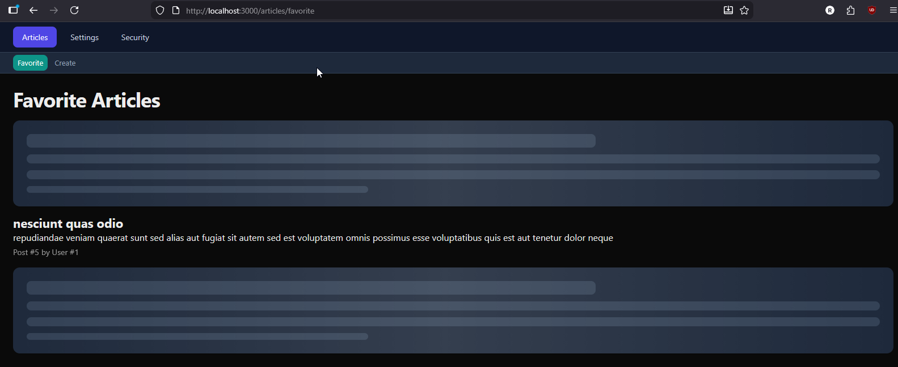
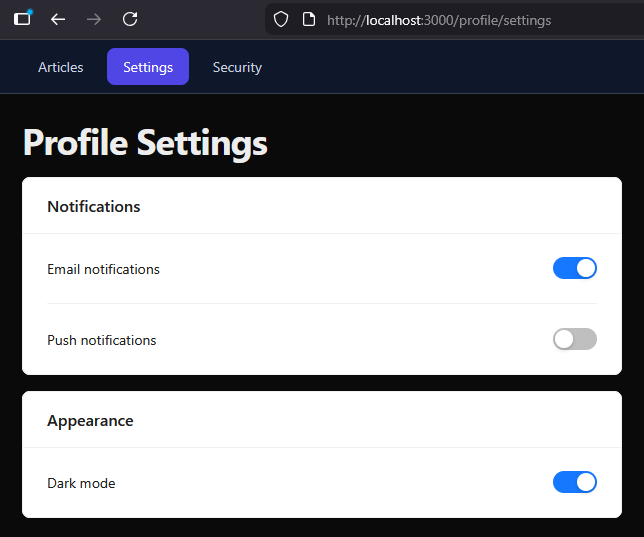
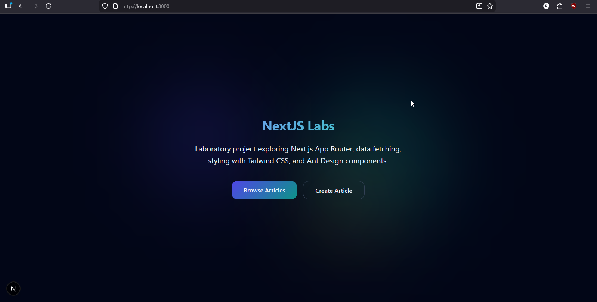
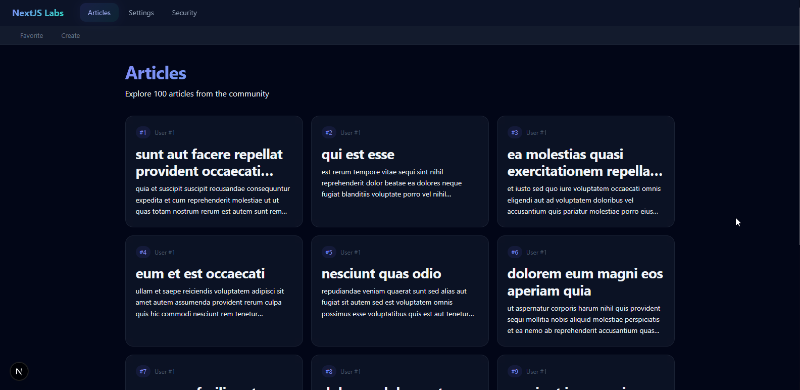
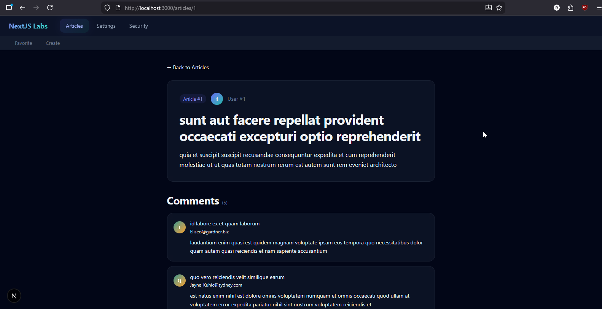
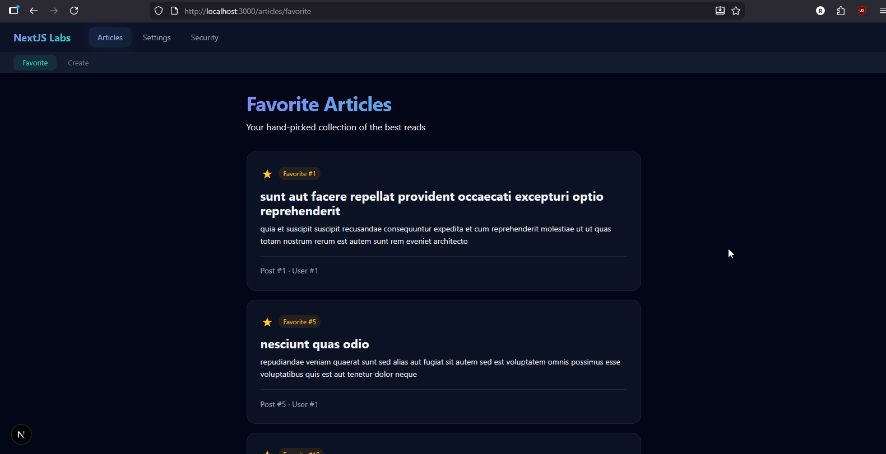
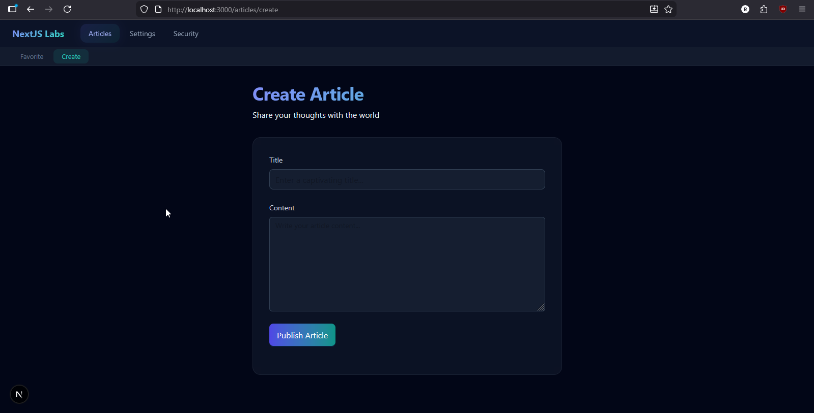
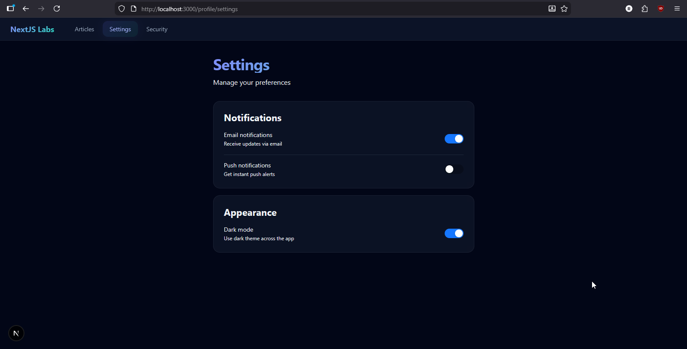
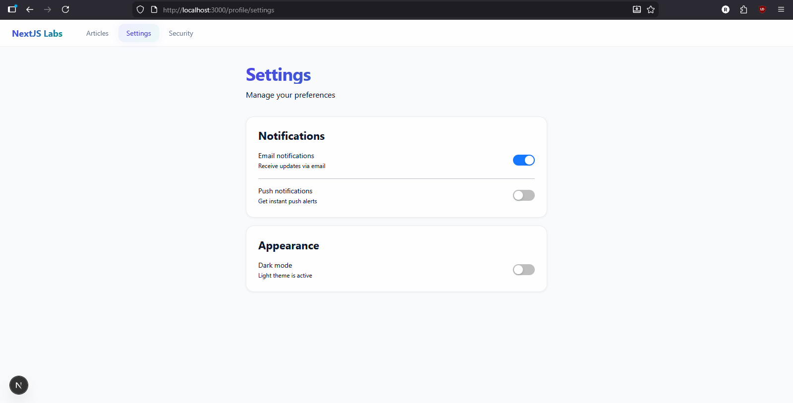

# NextJS Labs

A Next.js laboratory project built with TypeScript, Tailwind CSS v4, and App Router.

## Getting Started

### Prerequisites

- Node.js (v18+)
- npm

### Installation

```bash
npm install
```

### Development

```bash
npm run dev
```

Open [http://localhost:3000](http://localhost:3000) in your browser.

### Production Build

```bash
npm run build
npm run start
```

---

<details>
<summary><b>📘 Lab 1 — Project Setup, Pages, Data Fetching, Styling & Design</b></summary>

### Task 1 — Project Setup

- Initialized the project with `npx create-next-app` (TypeScript, ESLint, Tailwind CSS, App Router)
- Migrated to `src/` directory structure
- Cleaned default Next.js template

#### Screenshots

**Checking Node.js and npm versions:**


**Project structure after setup:**


---

### Task 2 — Pages & Navigation

- Created pages: `/`, `/articles`, `/articles/favorite`, `/articles/create`, `/profile/settings`, `/profile/security`
- Route Group `(main)` for shared layout (all pages except `/`)
- Main navigation: Articles, Settings, Security
- Articles sub-navigation: Favorite, Create
- Active link highlighting via `NavLink` component using `usePathname()`

#### Screenshots

**Home page (`/`) — no navigation:**


**Articles page (`/articles`) — main nav + sub-nav:**


**Profile Settings (`/profile/settings`) — main nav only:**


---

### Task 3 — Data Fetching

- Fetching all posts from JSONPlaceholder API on `/articles`
- `loading.tsx` shows loading state while articles are being fetched
- `/articles/favorite` — 3 independent `<Suspense>` boundaries with `FavoriteArticle` async component
- `/articles/[id]` — dynamic page fetching post + comments in parallel
- `generateStaticParams()` for static generation of articles with ID 1-10
- TypeScript interfaces for API responses in `lib/types.ts`

#### Screenshots

**Articles page loading state:**


**Articles list after loading:**


**Favorite articles list after loading:**


**Article detail page with comments:**


**Console output for fetching data:**


---

### Task 4 — Styling

- Global CSS files: `variables.css` (design tokens), `typography.css`, `layout.css`
- CSS Module for navigation menu (`NavMenu.module.css`)
- Custom Tailwind CSS v4 theme: breakpoints (xs–2xl), color palettes (primary, secondary, accent, neutral)
- Shimmer skeleton loading components (`ui/skeletons.tsx`) with Tailwind classes
- Ant Design integration with `AntdRegistry` for SSR
- Ant Design components: Form, Input, Button, Card, Switch, Divider

#### Screenshots

**Styled navigation with active state:**



**Skeleton loading with shimmer animation:**



**Create Article page with Ant Design form:**


**Profile Settings with Ant Design components:**



---

### Task 5 — Design

- Dark mode as default with working light mode toggle (ThemeProvider + localStorage)
- Hero landing page with animated gradient blobs and CTA buttons
- Glassmorphism navigation bar with sticky positioning and gradient logo
- Articles page with responsive card grid (1/2/3 columns) and hover animations
- Article detail with gradient avatars and styled comments section
- Favorite articles with accent color badges and fade-in animations
- Dark-themed Ant Design forms with gradient buttons
- Inter font for improved readability
- Smooth theme transition (0.3s ease)

#### Screenshots

**Hero landing page:**



**Articles card grid:**



**Article detail with comments:**



**Favorite articles:**



**Create article form:**



**Settings — dark theme:**



**Settings — light theme:**



</details>

